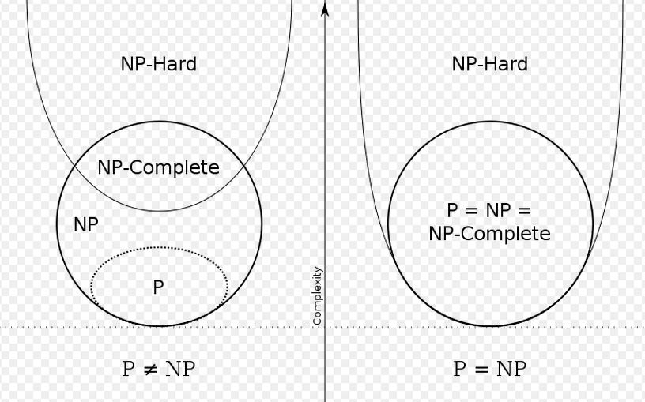

# NP-Complete 問題

## 演算法的複雜度

通常我們會用 BigO 的觀念來描述一個演算法的複雜度。舉例而言、泡沫排序 (Bubble Sort) 的複雜度為    ，而插入排序 (Insertion Sort) 的複雜度則為    。

對於那些複雜度可用    規範的演算法而言，在 n 很大的時候，其成長速率會比    這類的函數要慢上許多。因此、在理論上而言，我們寧可用    的演算法，也不要用    的演算法。

我們稱那些複雜度受    限制的演算法為「多項式時間演算法」 (Polynomial Time Algorithm)， 而那些超越    限制，但受    限制的演算法為「指數時間演算法」 (Exponential Time Algorithm)。

但是、有些問題很明確的需要    的時間，例如河內塔問題，在圓盤數為 n 的時候，需要移動    次才能完成。

不過、有些問題我們並不知道需要多久的時間才能完成，甚至不知道其複雜度到底是    或    ，在這類的問題當中，有一群稱為 NP-Complete 的問題，特別受到「計算機科學」領域的學者所重視。

## 非決定性演算法 (Nondeterministic algorithm)

在電腦領域，非決定性演算法是指那些「針對相同的輸入，每次執行結果可能不同的演算法」，像是「平行的演算法」就會與「執行順序」有關，而「隨機式演算法」則會與「亂數的產生方式」有關。

## NP (Nondeterministic Polynomial Time) 問題

如果一個「隨機式演算法」有時只需要「多項式時間」，但有時又需要「指數時間」才能完成，這類的演算法就稱為「非決定性多項式時間」(Nondeterministic polynomial time) 演算法。

而那些可以用「非決定性多項式時間演算法」解決的問題，我們就稱為 NP 問題。

當然、有很多問題都屬於 NP 問題。

舉例而言、像是排序問題可以用 O(N log N) 複雜度的演算法解決，由於    ，所以排序問題的複雜度低於 O(N^2) ，所以當然屬於「多項式時間」的問題。

同樣的、像是「搜尋、矩陣相乘、計算反矩陣、....」等等常見的問題，幾乎都屬於「多項式時間」的問題，當然也可以用「決定性多項式時間的演算法」(Deterministic Polynomial Time Algorithm)來解決。

事實上，上述那些明確受制於    的問題，像是「排序、搜尋、矩陣相乘、計算反矩陣、....」等等，都屬於「決定性多項式問題」(Polynomial Time Problem)，簡稱 P 問題。

但是、對於某些問題，我們知道當採用「非決定性演算法」的時候，有時可以很快的傳回解答 (在    之內)，有時卻又要很久才能傳回解答 (需要    的步驟)，但是我們卻沒有把握每次都能多項式時間    內傳回解答。這種問題屬於「非決定性多項式時間」當中較難的一類問題，這類問題是我們特別想要關注的「較難的 NP 問題」。

## NP-Complete 問題

在這類較難的 NP 問題當中，有一群很特別的問題，他們相互之間可以互相轉換 (在多項式時間內)，只要其中一個問題可以在多項式時間內解決，那麼其他問題也都將可以在多項式時間內解決，這一群問題稱為 NP-Complete 問題。

而那些至少與 NP-Complete 問題一樣難，甚至是更難的問題，則稱為 NP-Hard 問題。

下圖顯示了 P, NP, NP-Complete, NP-Hard 等四類問題之間的關係。

由於到目前為止，我們並不知道 NP 與 P 問題兩者是否相等，也就是無法找到一個問題是落在 NP 當中，卻又能證明不屬於 P ，因此我們無法知道 「P、NP 與 NP-Complete」之間的關係究竟應該是如上述左圖或右圖的情況。

從 1971 年 Stephen Cook 提出 NP-Complete 概念與證明以來，從來沒有人能有效解答「P 是否等於 NP」的這個問題，因此這個問題已經成為資訊領域當中最大的謎團之一。 (Stephen Cook 因此在 1982 獲得了「圖靈獎」 (Turing Award)。

後來、Richard Karp 緊接著在 「Reducibility Among Combinatorial Problems」這篇論文中提出了 21 個互相可化約的 NP-Complete 問題。後來 Richard Karp 在 1985 年更因此獲得了「圖靈獎」。

目前已知的 NP-Complete 問題有很多，以下是一些具有代表性的 NP-Complete 問題。

* Boolean satisfiability problem (SAT) -- 布林式滿足問題
* Knapsack problem -- 背包問題
* Hamiltonian path problem -- 漢彌爾頓路徑問題
* Travelling salesman problem -- 旅行推銷員問題
* Graph coloring problem -- 著色問題

## SAT 問題

在上述的 NP-Complete 問題當中，SAT 問題是特別具有歷史價值的，因為 SAT 問題是 Stephen Cook 提出 NP-Complete 概念的關鍵，所以我們必須先理解 SAT 問題，才能理解 NP-Complete 理論的核心。

SAT 問題的全稱是 Boolean satisfiability problem，也就是「布林式滿足問題」，要瞭解 SAT 問題，首先必須先瞭解何為「布林代數式」。(請參考本書 「布林邏輯」 一章)。

舉例而言，以下是一些布林代數式：

* 範例 1: (A | B | C)&(B | -A | -C)
* 範例 2: (P & -P)|(Q & -Q)
* 範例 3: (P | -P)&(Q | -Q)

針對上述的「布林代數式」，您可以看到範例 2 是無法被滿足的，因為不管 P 與 Q 如何指定，(P & -P) 和 (Q & -Q) 永遠都會傳回 false，因為兩者都是矛盾式，所以無法被滿足。

相反的、範例 3 是永遠都會被滿足的，不管我們怎麼指定， (P | -P) 永遠為真，而(Q | -Q)也是一樣，這種「布林代數式」稱為恆真式 (Tautolog，有人採用音譯的方式，翻譯成套套邏輯)。

對於範例 1 而言，如果我們指定 (A=0, B=1, C=0)，那麼該運算式將會被滿足 (傳回 1, 也就是 true)。如果我們指定 (A=0, B=0, C=0)，那麼該運算式將會傳回 0 (也就是 false)。這種可備滿足的「布林代數式」就稱為 satisfiabile。

如果任意給定一個「布林代數式」，我們是否能設計一個演算法去找出滿足該「布林式」的解答呢？這個問題就稱為 Boolean satisfiability problem，也就是 SAT 問題了。

## 證明：SAT 是 NP-Complete 問題

那麼、SAT 為何是 NP-Complete 問題呢？換句話說、為何所有的「非決定性多項式時間演算法」(Nondeterministic polynomial time algorithm) 所能解決的問題 (NP 問題)，都可以化約為 SAT 問題呢？

關於這個問題，得先讓我們仔細想想到底「非決定性演算法」在做些甚麼事情？

更明確的說，一個「非決定性的圖靈機」到底在做些甚麼事情？

您只要看看下列表格，就能夠理解 Stephen Cook 到底在玩些甚麼把戲了！

如果我們用 (Q, Σ, s, F, δ) 來描述一台非決定性圖靈機，其中各個符號的意義如下：

| 符號 |  說明 |
|------|-------------------|
|      |   狀態集合 |
|     |    磁帶上的字母集合 |
|      |   起始狀態，是 Q 中的一個元素 |
|      |   結束狀態，是 Q 的子集合 |
|     | 轉換關係，是 ((Q \ F) × Σ) × (Q × Σ × {−1, +1}) 的子集合 |

接著我們可以定義一大群布林變數如下：

| 符號 |       說明 | 
|-----|------------------------------------------------| 
|    |  當磁帶的第 i 格為符號 j (在第 k 步時) 傳回 true | 
|     |  當機器的讀寫頭在第 i 格上 (在第 k 步時) 傳回 true | 
|     |  當機器處於狀態 q 時 (在第 k 步時) 傳回 true | 

然後、根據上述的符號定義，我們可以寫出一大堆邏輯式來描述這台「非決定性圖靈機」的行為，如下表所示：

| 布林運算式            |  條件   | 說明  | 
|-----------------------|---------|-----------------------------------------|
|    |  j ≠ j′ | 磁帶上每格只能有一個符號	|
|    |  j ≠ j' | 磁帶未被寫入時符號不變 |
|      |  q ≠ q' | 機器在單一時間只能有一個狀態 |
|      |  i ≠ i' | 讀寫頭單一時間只能有一個狀態 |
|    | k<p(n)| 第 k 步時讀寫頭在位置 i 的狀態轉移描述 |
|    |  | 最後結束時必須在接受狀態 |

如此我們就可以完整的描述一台「非決定性圖靈機」的行為，並且將這些行為與 「SAT 布林代數式滿足問題」畫上等號，只要該圖靈機最後會停在接受狀態，「SAT 布林代數式就能被滿足」。

透過這種方式，Stephen Cook 將「非決定性圖靈機」轉換成 SAT 問題，然後證明了 「SAT 問題的滿足與 NP 問題是否有解等價」，於是 NP 問題巧妙的轉化成 SAT 問題，並且創造出了 NP-Complete 這個奇特的概念。然後當 Richard Karp 找出了 21 個可化約為其他 NP-Complete 的問題之後，這一整群的問題就通通都被視為計算複雜度上等價的問題了。

## 結語

雖然 Stephen Cook 所造出來的這個「SAT 布林代數式」很大，但該代數式與「非決定性圖靈機」之間的轉換卻可以在「多項式時間內」轉換完成 (幾乎都小於    )，因此這個轉換並不會造成複雜度膨脹太大的問題。

透過這種轉換方式，SAT 成了全世界第一個 NP-Complete 問題，而對於某個問題 X 而言，只要我們能在多項式時間內將 SAT 問題或任何一個已知的 NP-Complete 問題轉換為 X (在多項式時間內)，那麼就可以再度找到一個 NP-Complete 問題，於是 NP-Complete 問題就成了一個互相可化約 (reduce) 的族群。

## 參考文獻
* [Wikipedia:NP完全](http://zh.wikipedia.org/wiki/NP%E5%AE%8C%E5%85%A8)
* [Wikipedia:NP-complete](http://en.wikipedia.org/wiki/NP-complete)
* [Wikipedia:河內塔](http://zh.wikipedia.org/wiki/%E6%B1%89%E8%AF%BA%E5%A1%94)
* [Wikipedia:Oracle machine](http://en.wikipedia.org/wiki/Oracle_machine)
* [Wikipedia:預言機](http://zh.wikipedia.org/wiki/%E8%B0%95%E7%A4%BA%E6%9C%BA)
* [Wikipedia:Cook-Levin理論](http://zh.wikipedia.org/wiki/Cook-Levin%E7%90%86%E8%AB%96)
* [Wikipedia:Nondeterministic algorithm](http://en.wikipedia.org/wiki/Non-deterministic_algorithm)
* [Wikipedia:Cook–Levin theorem](http://en.wikipedia.org/wiki/Cook%E2%80%93Levin_theorem)

【本文由陳鍾誠取材並修改自 [維基百科]，採用創作共用的 [姓名標示、相同方式分享] 授權】

